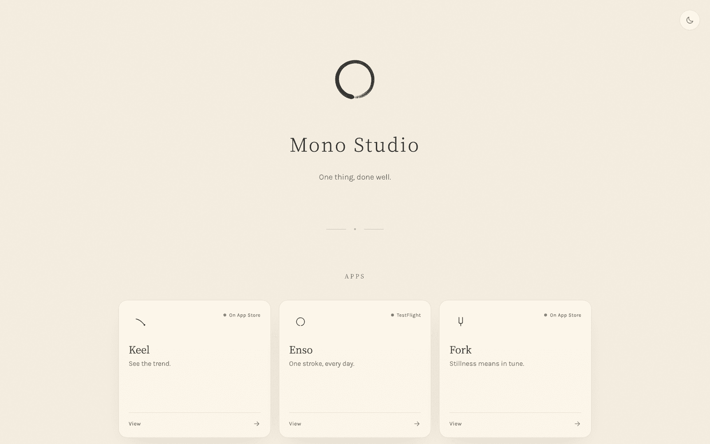

# Mono Studio



The website for [Mono Studio](https://monostudio.site), a collection of
single-purpose iOS apps. Built with Astro and React, with static page output.

## Development

Use Bun to keep dependencies consistent with the committed `bun.lock`.
Node.js 22.12 or later is required when running the tooling through Node.

```sh
bun install --frozen-lockfile
bun run dev
bun run build
```

The development server runs at `http://localhost:4321`. Production output is
written to `dist/`. Add dependencies with `bun add`.

## Project structure

- `src/pages/`: app pages, studio information and privacy policy.
- `src/layouts/`: shared page layouts and metadata.
- `src/components/`: screenshot gallery and lightbox.
- `src/lib/brush.ts`: canvas rendering for the homepage ensō.
- `public/`: app screenshots, icons and discovery files.

The homepage mark has an SVG fallback for browsers without JavaScript.
Reduced-motion mode displays the completed mark without animating it.
Fonts are self-hosted through Fontsource, and styles are inlined during build.

## Analytics

The site uses LoggerLizard for page-view analytics, configured in
`src/lib/loggerlizard.js`. The client identifier is public. See the
[privacy policy](https://monostudio.site/privacy) for the site's data practices.

## Licence

This repository does not grant an open-source licence. The Mono Studio name,
app icons, artwork and written content remain reserved to their owners.
Third-party dependencies retain their own licences.
